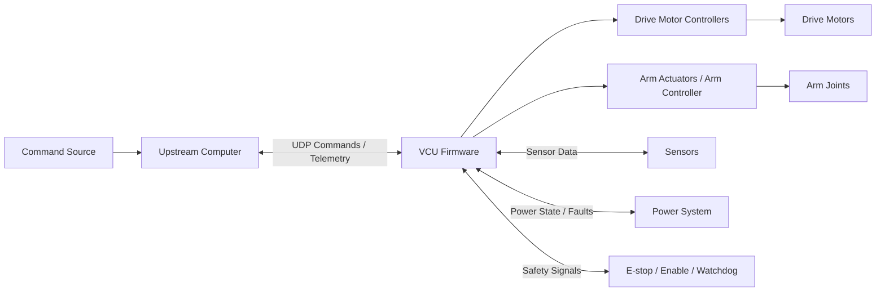
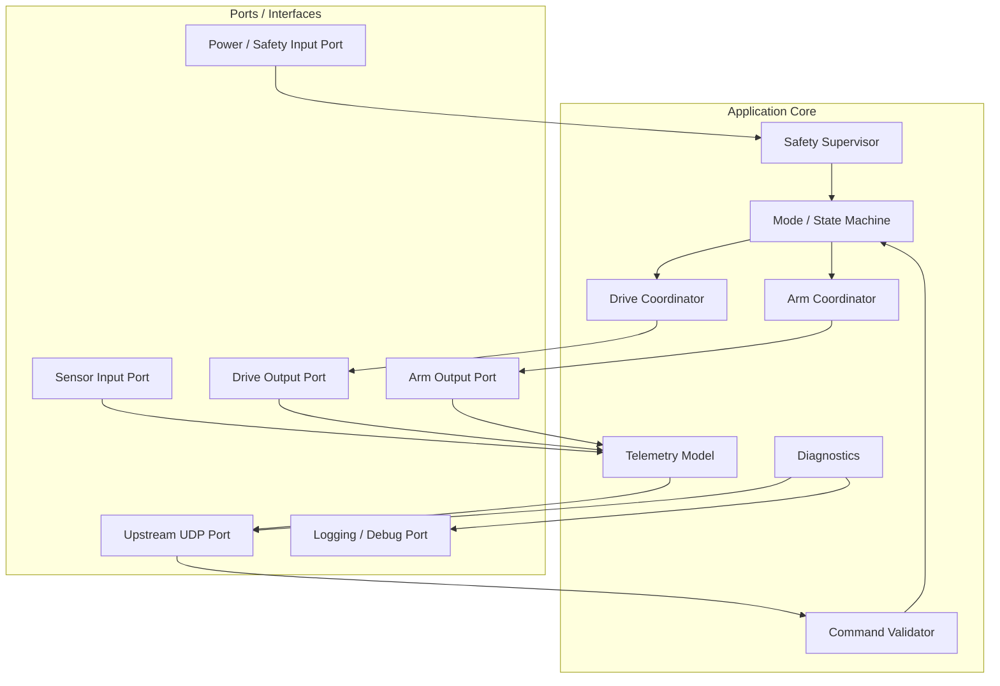
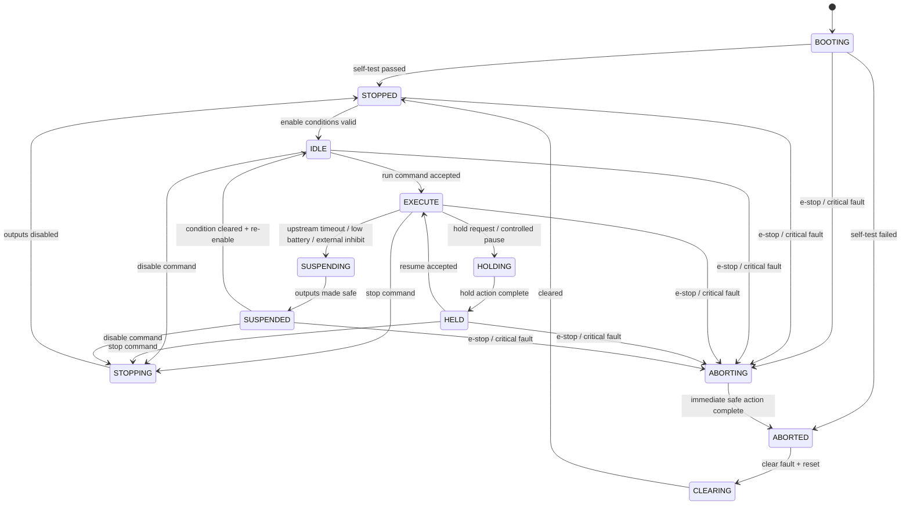
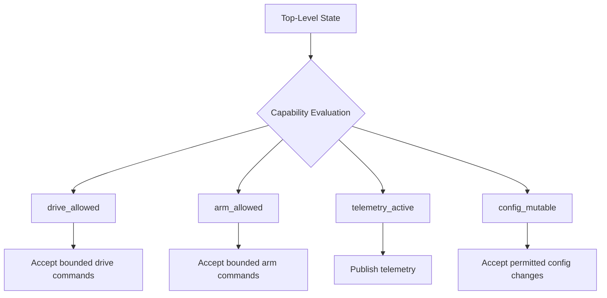
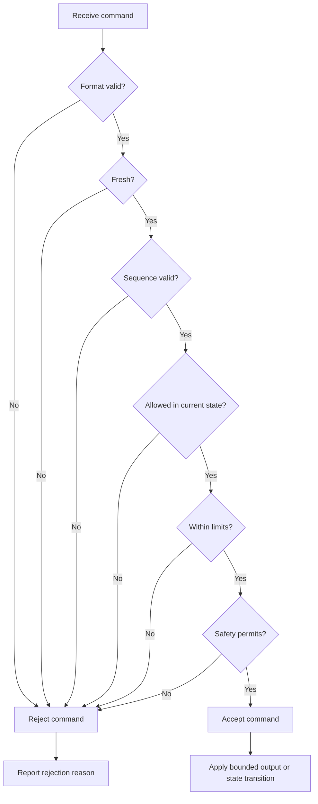
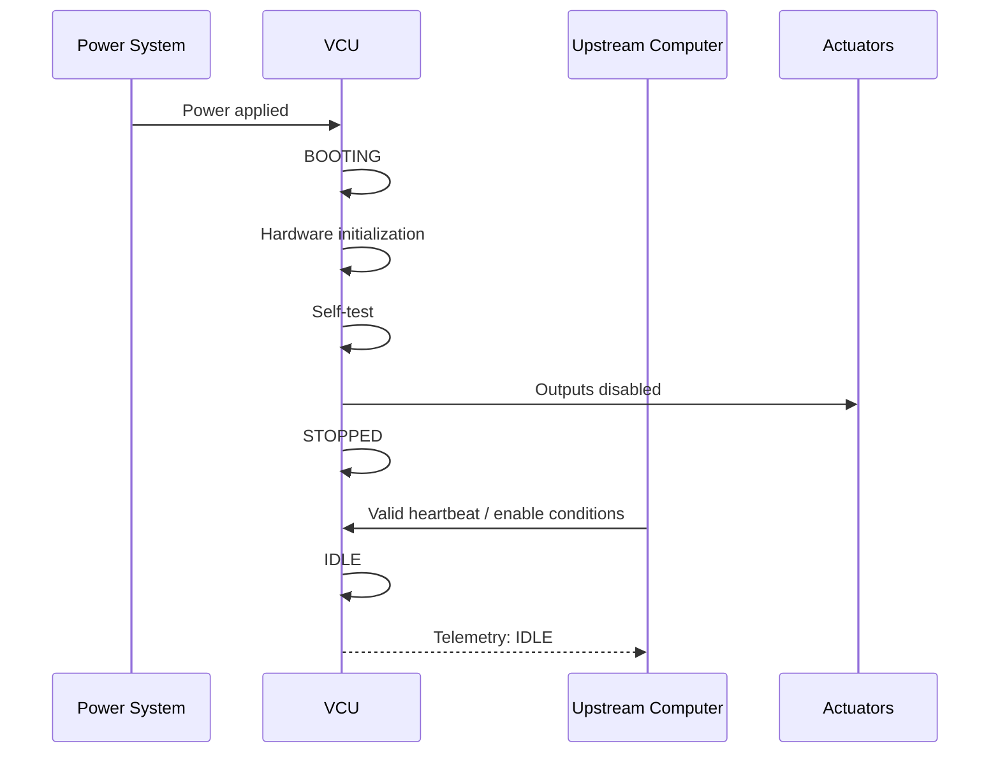
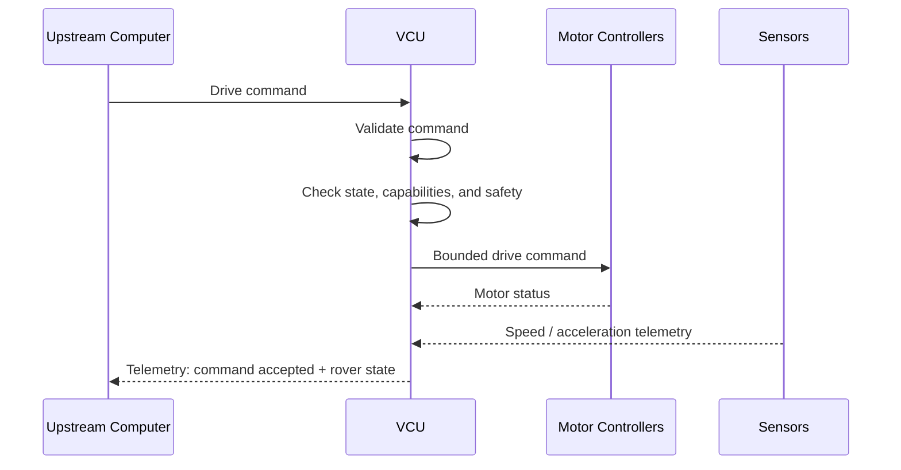
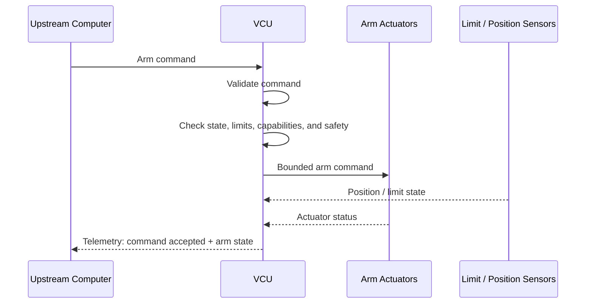
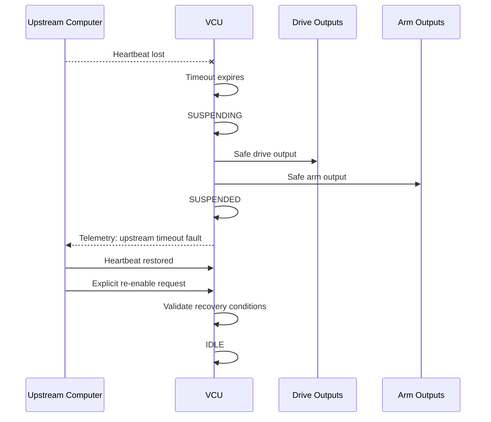
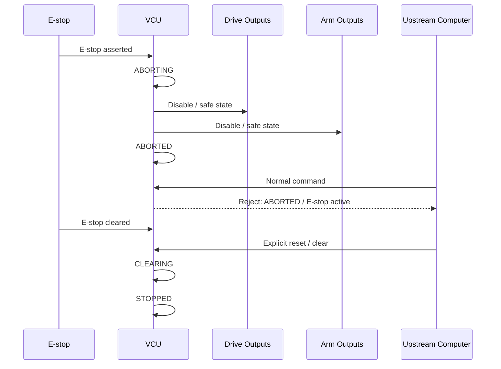

# Rover VCU Firmware

This repository contains the firmware for the rover Vehicle Control Unit (VCU).

The VCU sits between the upstream computer and the rover's physical subsystems. It receives high-level command intent over UDP, validates and arbitrates those commands locally, coordinates drive and arm outputs, collects telemetry, supervises safety state, and reports diagnostics.

The main design rule is:

> Upstream communication is an input to local decision-making, not direct authority over actuators.

That means the firmware does not blindly forward network commands to motors or actuators. Commands are checked for freshness, sequence, range, operating mode, and safety state before any downstream output is updated.

## Getting Started
### Initialization
```bash
# initialize my-workspace for the example-application (main branch)
west init -m git@github.com:jumper385/rover-vcu-fw_2026 --mr main vcu-fw-ws
# update Zephyr modules
cd vcu-fw-ws
west update
```

### Building the Firmware
the `$BOARD` is the target you're trying to build with. For starters you could compile for the `nucleo_h563zi` development board.
```bash
cd vcu-vcu-fw_2026
west build -b $BOARD app # $BOARD is nucleo_h563zi
```
If you want to get debugging outputs (i.e. enable logging and shell), you can attach additional CLI params; 
```bash
west build -b $BOARD app -- -DEXTRA_CONF_FILE=debug.conf
```

Once it's built, you flash it by plugging in the st-link (or the dev board) and running:
```bash
west flash
```

### Running Unit Tests
Where required, you may also run unit tests. Run tests as follows:
```bash
west twister -T tests --platform qemu_cortex_m0
```

---

## System Context



The upstream computer may run autonomy, navigation, mapping, or operator-control software. It can request motion or arm actions, but the VCU owns local validity checks, state transitions, safe fallback behaviour, and downstream command bounding.

---

## Firmware Responsibilities

The firmware is responsible for:

- receiving upstream UDP commands;
- validating command format, freshness, sequence, mode, and range;
- maintaining a top-level operating-state machine;
- applying safety overrides from E-stop, enable, watchdog, power, and subsystem faults;
- translating accepted drive intent into bounded downstream drive commands;
- translating accepted arm intent into bounded downstream arm commands;
- collecting telemetry from sensors, drive controllers, arm controllers, power, and safety inputs;
- publishing telemetry and diagnostics upstream;
- supporting bench, simulation, and hardware-in-the-loop style testing;
- exposing SWD programming/debug access for manual firmware flashing.

The firmware is not responsible for:

- high-level autonomy or path planning;
- user interface logic;
- mechanical arm design;
- low-level motor-driver internals, unless explicitly implemented in the VCU later;
- runtime firmware update or bootloader update over the network.

Firmware is flashed manually using SWD.

---

## Architecture Plan

The firmware should be structured so that core logic is independent of transport and hardware details.



Recommended layering:

| Layer | Purpose |
|---|---|
| Application core | State machine, safety logic, command validation, drive/arm coordination |
| Ports | Abstract interfaces used by the core |
| Adapters/drivers | UDP, CAN, GPIO, ADC, UART, SPI, motor-driver-specific code |
| Platform | MCU startup, clocks, RTOS/bare-metal scheduling, board support |

This keeps the important behaviour testable without final hardware. For example, the same state machine and command validator should run against fake ports in unit tests and real ports on the rover.

---

## Top-Level State Machine

The VCU uses a PackML-inspired state model. This keeps lifecycle/safety state separate from capability flags such as whether drive or arm commands are allowed.



### State Meaning

| State | Meaning |
|---|---|
| `BOOTING` | Hardware and firmware are starting. Outputs are not trusted. |
| `STOPPED` | VCU is initialized and actuator outputs are disabled. |
| `IDLE` | VCU is ready and telemetry is active, but motion is not executing. |
| `EXECUTE` | VCU may accept valid actuation commands according to enabled capabilities. |
| `HOLDING` | VCU is transitioning into a controlled hold. |
| `HELD` | VCU is maintaining a controlled non-progressing state. |
| `STOPPING` | VCU is performing a controlled stop or ramp-down. |
| `SUSPENDING` | VCU is responding to an external condition that prevents normal operation. |
| `SUSPENDED` | VCU is safely paused due to an external condition, such as upstream timeout. |
| `ABORTING` | VCU is performing immediate safety response to a critical event. |
| `ABORTED` | VCU is in a latched critical-fault or E-stop state. |
| `CLEARING` | VCU is clearing a fault/abort condition after explicit reset. |

---

## Capability Flags

Top-level state should not explode into combinations like `DRIVE_ENABLED`, `ARM_ENABLED`, `FULL_OPERATION`, `DEGRADED_DRIVE_ONLY`, etc. Instead, use a small top-level state machine plus capability flags.

By doing this, timer or work functions can be globally enabled forever however, when they do arrive at the events, the operation is gated by the capability flags.

| Capability | Meaning |
|---|---|
| `drive_allowed` | Drive commands may be accepted. |
| `arm_allowed` | Arm commands may be accepted. |
| `telemetry_active` | Telemetry should be published. |
| `config_mutable` | Runtime configuration changes may be accepted. |
| `manual_control_allowed` | Manual/operator command source may control the rover. |
| `autonomy_control_allowed` | Autonomy command source may control the rover. |
| `fault_reset_allowed` | Fault reset commands may be accepted. |

Example:



A command is accepted only if both the top-level state and the relevant capability permit it.

---

## Command Handling

Incoming commands should pass through a single validation path before they affect system state or outputs.



Command validation should check at least:

- packet format and version;
- command type;
- sequence number;
- timestamp or freshness window;
- current top-level state;
- capability flags;
- configured limits;
- safety state;
- subsystem availability.

Invalid commands should be rejected explicitly and reported in telemetry where practical.

---

## Safety and Fault Handling

Safety state overrides normal command handling.

High-priority safety events include:

- E-stop asserted;
- hardware enable removed;
- watchdog expired;
- upstream heartbeat timeout;
- critical power fault;
- brownout;
- motor-controller critical fault;
- arm-controller critical fault;
- sensor fault that invalidates safe operation.

General behaviour:

| Event | Expected Behaviour |
|---|---|
| E-stop asserted | Enter `ABORTING`, force safe outputs, then latch in `ABORTED`. |
| Upstream timeout | Enter `SUSPENDING`, make outputs safe, then enter `SUSPENDED`. |
| Stop command | Enter `STOPPING`, perform controlled stop, then enter `STOPPED`. |
| Non-critical fault | Restrict capabilities or enter `SUSPENDED`, depending on severity. |
| Critical fault | Enter `ABORTING` then `ABORTED`. |
| Fault clear/reset | Only accepted when conditions are safe and reset is explicitly requested. |

---

## Telemetry and Diagnostics

Telemetry should describe both rover state and command-processing state. This is important because upstream software needs to know not just what the rover is doing, but whether commands are being accepted or rejected.

Candidate telemetry fields:

| Data | Purpose |
|---|---|
| Current VCU state | Shows `BOOTING`, `STOPPED`, `IDLE`, `EXECUTE`, etc. |
| Capability flags | Shows whether drive, arm, telemetry, config, or reset actions are allowed. |
| Safety state | Reports E-stop, enable, watchdog, timeout, and fault status. |
| Last command status | Accepted, rejected, stale, invalid, out-of-range, wrong-state, unsafe. |
| Last rejection reason | Helps debug upstream command issues. |
| Drive telemetry | Speed, current, controller state, drive faults. |
| Arm telemetry | Position, limit state, current, actuator state, arm faults. |
| Power telemetry | Voltage, current, brownout, power-good state. |
| Diagnostic counters | Uptime, reset reason, packet counters, bus errors, fault counters. |

Telemetry should remain active in `IDLE`, `EXECUTE`, `HELD`, `SUSPENDED`, and fault states where practical.

---

## Nominal Scenarios

### Startup to Idle



Expected behaviour:

- outputs start disabled;
- self-test runs before actuation is possible;
- telemetry reports startup and readiness state;
- the VCU enters `IDLE` only when enable conditions are valid.

### Nominal Drive Command



Expected behaviour:

- command is checked before use;
- output is bounded by configured limits;
- motor status and rover telemetry are reported upstream;
- rejection reason is reported if the command is not accepted.

### Nominal Arm Command



Expected behaviour:

- arm command is accepted only when `arm_allowed` is true;
- limit and fault state are checked before output;
- arm status is included in telemetry.

---

## Off-Nominal Scenarios

### Upstream Timeout



Open policy questions:

- Should the arm hold, brake, coast, or disable on upstream timeout?
- Should timeout recovery be automatic after heartbeat returns, or require operator re-enable?
- Should drive and arm timeout behaviours differ?

### Invalid Command

Expected behaviour:

- command is rejected;
- previous valid output is not blindly overwritten;
- the system either maintains safe output or transitions to a safer state;
- telemetry reports the rejection reason.

### E-stop Asserted



Expected behaviour:

- E-stop has priority over all normal commands;
- recovery requires explicit clearing/reset;
- normal commands are rejected while E-stop/abort state is active.

---

## Development Plan

A sensible implementation order is:

1. Define core data types: commands, telemetry, faults, state, capabilities.
2. Implement the top-level state machine with fake inputs and outputs.
3. Implement command validation with unit tests.
4. Implement safety supervisor logic with fault-injection tests.
5. Implement fake ports for upstream, drive, arm, sensors, and power.
6. Run scenario tests against the core logic.
7. Add real board-support and hardware drivers.
8. Add UDP adapter.
9. Add downstream drive and arm adapters.
10. Add telemetry publishing.
11. Integrate on bench with actuators disabled.
12. Integrate with real subsystems under controlled conditions.

The core should be usable before the final hardware is ready.

---

## Suggested Repository Structure

```text
firmware/
├── README.md
├── docs/
│   ├── opscon.md
│   ├── interfaces.md
│   ├── safety.md
│   └── testing.md
├── include/
│   └── vcu/
│       ├── command.h
│       ├── telemetry.h
│       ├── state.h
│       ├── capabilities.h
│       └── fault.h
├── src/
│   ├── app/
│   │   ├── state_machine.c
│   │   ├── command_validator.c
│   │   ├── safety_supervisor.c
│   │   ├── drive_coordinator.c
│   │   ├── arm_coordinator.c
│   │   └── telemetry_model.c
│   ├── ports/
│   │   ├── upstream_port.h
│   │   ├── drive_port.h
│   │   ├── arm_port.h
│   │   ├── sensor_port.h
│   │   └── power_port.h
│   ├── adapters/
│   │   ├── udp_adapter.c
│   │   ├── drive_adapter.c
│   │   ├── arm_adapter.c
│   │   ├── sensor_adapter.c
│   │   └── power_adapter.c
│   └── platform/
│       ├── board.c
│       ├── clocks.c
│       └── main.c
└── tests/
    ├── unit/
    │   ├── test_state_machine.c
    │   ├── test_command_validator.c
    │   └── test_safety_supervisor.c
    └── scenario/
        ├── test_startup_to_idle.c
        ├── test_upstream_timeout.c
        ├── test_invalid_command.c
        └── test_estop.c
```

This structure is only a starting point. The important idea is to keep `app/` independent of the concrete hardware and network adapters.

---

## Testing Strategy

Minimum tests to build early:

| Test Area | What to Check |
|---|---|
| State machine | Allowed and disallowed transitions |
| Command validation | Malformed, stale, duplicate, wrong-state, and out-of-range commands |
| Safety supervisor | E-stop, timeout, watchdog, power fault, downstream critical fault |
| Capability flags | Drive/arm/config/reset permissions in each state |
| Telemetry | Correct reporting of state, command status, and fault reason |
| Scenario tests | Startup, drive command, arm command, timeout, invalid command, E-stop |

Scenario tests should use fake ports and run without physical rover hardware.

---

## Open Questions

| ID | Question | Why It Matters |
|---|---|---|
| `RQ-001` | What is the safe state for each actuator? | Drive and arm may need different safe behaviours. |
| `RQ-002` | What is the UDP heartbeat timeout? | Too short causes nuisance stops; too long permits stale motion. |
| `RQ-003` | Does upstream command velocity, heading, wheel speed, or torque? | Defines VCU control responsibility. |
| `RQ-004` | Does the VCU close speed loops or only command motor drivers? | Major firmware/control split. |
| `RQ-005` | What telemetry rate is required? | Affects CPU, bandwidth, and logging. |
| `RQ-006` | Which faults are latched? | Affects recovery and operator workflow. |
| `RQ-007` | Which safety behaviours are hardware-enforced? | Affects PCB and firmware architecture. |
| `RQ-008` | How are arm limits enforced? | Affects arm safety and command rejection. |
| `RQ-009` | How are configurations versioned? | Prevents incompatible upstream/VCU operation. |
| `RQ-010` | What must work without upstream? | Defines autonomy boundary. |

---

## Implementation Notes

Prefer explicit, boring logic over clever implicit behaviour.

Good patterns:

- one state-transition function;
- one command-validation path;
- explicit rejection reasons;
- clear safe-output functions;
- fake ports for tests;
- no direct network-to-actuator path;
- no hidden state transitions inside low-level drivers;
- telemetry for every major state transition and fault.

Avoid:

- encoding drive/arm combinations as top-level states;
- allowing stale commands to persist indefinitely;
- treating UDP packet arrival as actuator authority;
- hiding safety decisions in hardware drivers;
- making tests depend on real motors or real network hardware.
